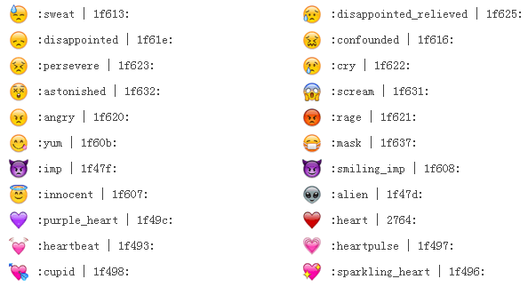

# Emoji - CSS Sprites
Reference:[http://www.emoji-cheat-sheet.com/](http://www.emoji-cheat-sheet.com/)
Emoji element size: **width: 22px; height: 22px;**

## Snapshot


## Usage
Add the lines to the HEAD:
```html
<link href="emoji.css" rel="stylesheet" type="text/css">
```
Use the emoji picture like this:
```html
 <span class="emoji emoji-smile"></span>
```
Or like this:
```html
 <span class="emoji emoji-1f604"></span>
```

## Notice
Emoji code `+1` stands for . But we can not directly use `+1` in a css selector, as `+` in a css selector is an adjacent sibling combinator(See [W3C CSS Selector](http://www.w3.org/TR/selectors/#selectors). So please user `.emoji-thumbsup` or `.emoji-plus1` or `.emoji-1f44d` instead.